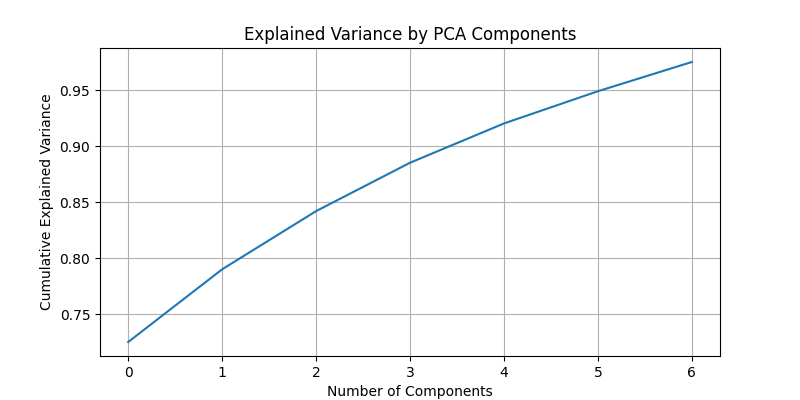

# PCA Analysis Documentation

This document details the Principal Component Analysis (PCA) process as implemented in the `pca_analysis.py` script for the Water Leak Detection Project. The corresponding Python script can be found [here](../src/pca_analysis.py).

## Overview

PCA is utilized in this project to reduce the dimensionality of normalized water usage data. By transforming the data into a set of linearly uncorrelated variables known as principal components, PCA enables the capture of most of the variance with fewer variables.

## Procedure

### Loading Data
The preprocessed and normalized data from the preprocessing stage is loaded, which includes features without the 'Anomaly' label.

### Applying PCA
PCA is conducted using scikit-learn's `PCA` class, initially set to retain 95% of the total variance. The `fit_transform` method is used to compute the principal components and transform the original features.

### Plotting Explained Variance
A plot of the cumulative explained variance is generated to visualize how much variance is captured by each component. This plot helps in deciding the number of components to retain for further analysis.

### Saving the Transformed Data
The PCA-transformed data is saved back into the `processed` directory as `X_train_pca.csv` and `X_test_pca.csv` for training and testing purposes, respectively.

## Graph Interpretation



The cumulative explained variance graph aids in selecting an appropriate number of principal components. The goal is to choose the smallest number of components that still capture a significant portion of the variance.

## Usage

To perform PCA analysis on your dataset, navigate to the project root directory and run the script as follows:

```bash
python src/pca_analysis.py
